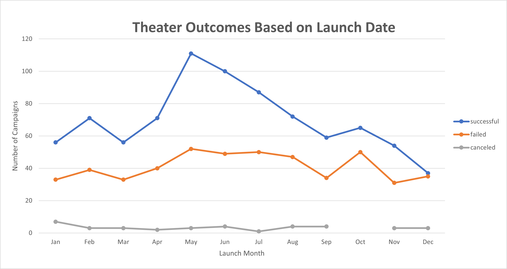
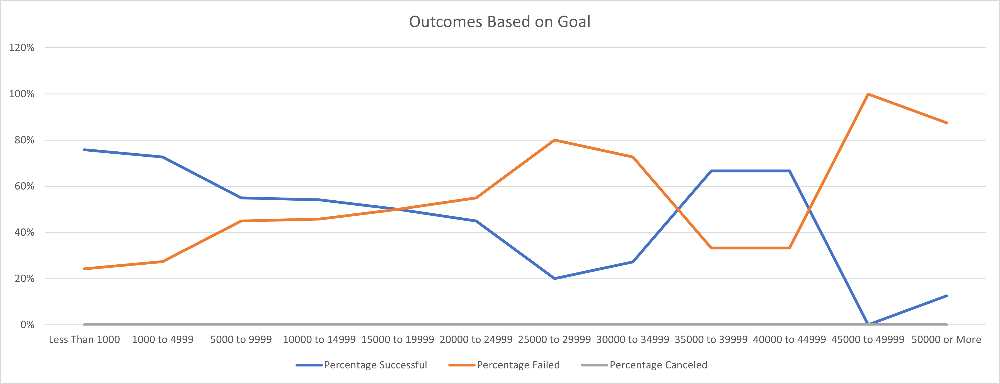

# Kickstarter Analysis Challenge 

## Overview of Project 
The purpose of the assignment was to analyze the given kickstarter data to determine if there was trends based on their funding goal as well as the months related to project launches. All analysis were focused on campaigns under the parent category of theater. 

## Analysis and Challenges 
### Analysis 
To start the analysis, we needed to look at the outcome of the project based on the Launch date. A pivot table was created in order to show the count of the projects based on outcome. When the pivot was created, adding the launch date defaults the data set to be separated by years and quarters, along with the exact date. As we wanted to see if there was any impact to the outcome based on the launch month, the years, and quarters fields were removed from the rows of the pivot table. This created a default grouping by month. 

### Challenges
Challenges that one may encounter with the pivot would be the formatting of the dates. If there was any dates in the data set not formatted as a date, there would mostly likely be issues when creating the pivot table. The incorrectly formatted data would have to be corrected in order for the pivot to be reflected correctly. Another potential challenge would be if all the data was not selected when creating the pivot chart. This would cause not all the data to populate in the chart and to be incomplete. 

## Results 
#### Theaters Outcome By Launch Date
By segregating the kickstarter projects by launch date for the theater parent category, we are able to see that the most successful projects were in the summer months (May- July). The month of May had the most projects launch, by volume, with over two thirds being successful. Others items to note, there is a decrease of total projects launched leading up to the holiday months (November and December), with more projects getting cancelled. Furthermore, there is a similar volume of projects that get cancelled each month, regardless of time year. This is shown below in Chart 1: Theater Outcomes vs Launch

Chart 1: Theater Outcomes vs Launch

#### Outcome Based on Goals 
By examaning the goals in relation to the outcome, we were able to see that as the goal increasesd initially, there was a decrease in success rate. While it does appear that the $35k to $45k goal ranges are successful, it is important to note that there was significantly few projects in that range. The data showed that over 80% of the projects had a goal of less than $10k. Noting that, the correlation between goal and success rate becomes stronger. This is shown below in Chart 2: Outcomes Based on Goal. 

Chart 2: Outcomes Based on Goal 

#### Limitations 
With every dataset, there are some limitations. The data analyzed was simplistic and assumed that all other factors considering all projects were equal. Success of their project could have other outside factors such as better marketing or geographical influences (not just in US). Something else to consider was the any outliers in the data set. Would it have been better to drop the two hundred thousand goal projects? These outliers can skew the data. In addition, there is launch data that spans over 8 years. It may have not been relevant to show data 5+ years out. 

#### Other Charts 
An interesting analysis would have been to see the rate of success over the years and also geographically. A potential chart would be to make a similar chart of outcomes by year rather than by month. To take it a step further, we could see if certain places have a better success rate. This could be shown by adding the countries to the mix. If there was an option to branch out of theater we could use line of bar graphs to illustrate successrates by categrory as well. 

